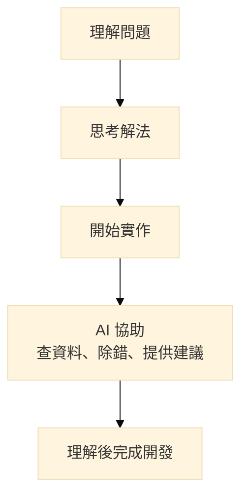

## 前言

最近，我去面試了一份 **AI 軟體開發實習生**。

從職缺內容來看，幾乎都是我目前正在學習的方向，包括：

- Python 程式修改與除錯
- ERP 功能開發與測試
- API 串接與測試
- 網站前端的 HTML、CSS、JavaScript 調整
- Bug 回報與修正
- 技術文件撰寫
- Git 版本管理
- AI 技術與 AI 工具的應用

所以一開始，我對這份實習很期待，也希望能透過實際專案累積更多開發經驗。

不過，面試後我發現，這份工作實際的開發方式和我原本想像的不太一樣。

思考了一段時間後，我最後決定不繼續往這個方向。

不是因為公司不好，也不是因為這種開發方式不好，而是我發現，它和我現階段想學習、想累積的東西不太一樣。

> **沒有誰對誰錯，只是現階段想學習的東西不同。**

而這次面試，也讓我開始思考：

> **在 AI 工具越來越普及的情況下，我希望自己成為什麼樣的工程師？**

## 面試時，我才知道他們是怎麼開發的

面試時，我和面試官聊了不少，也了解到他們目前的開發流程。

和我原本想像的不太一樣，他們的工作方式非常依賴 AI Agent。

工程師不需要從頭開始寫程式，而是先整理需求、規劃流程，再讓 AI Agent 協助完成部分開發工作。

工程師主要負責提供方向、調整需求，以及確認最後結果。

面試官也分享了他們平常如何拆解需求、安排不同 AI Agent 的工作，以及讓多個 Agent 協助完成一個功能。

老實說，這是我第一次實際看到把 AI Agent 整合到整個開發流程中。

讓我意識到，原來 AI 在開發流程中也可以扮演更主動的角色。

同樣都是使用 AI，但實際使用方式可以有很大的差異。

## 我平常使用 AI 的方式與想法

其實我平常也會使用不少 AI 工具。

像是 ChatGPT、GitHub Copilot、Claude，幾乎每天寫程式都會用到。

遇到不熟悉的技術、看不懂的錯誤訊息、想研究新的 API，或是不知道問題該怎麼解時，我通常都會先詢問 AI。

有時候也會請 AI 幫忙：

- 檢查程式碼
- 分析錯誤原因
- 提供不同做法
- 整理開發方向

不過目前我的使用方式比較偏向：

> **先自己思考，再請 AI 協助。**

我的開發流程大概比較像這樣：

對我來說，AI 比較像是一個協助開發的夥伴，而不是直接代替我完成整個專案。

因為我目前還在學習軟體開發的基礎，所以很多事情我希望自己先經歷一次

例如:

- 怎麼分析問題
- 怎麼規劃功能
- 怎麼設計程式結構
- 怎麼找出 Bug 的原因

這些過程雖然可能比較慢，但也是累積經驗的一部分。

我並不排斥更進階的 AI 使用方式。

像是 AI Agent、自動化流程，或是讓 AI 協助完成更多工作，我都覺得這些方向很有潛力。

只是以現在的我來說，我還希望先把自己的基礎建立起來。

如果遇到一個功能，直接請 AI 幫忙完成，確實可以更快得到結果。

但我也會想：

> 「我是真的理解這個解法，還是只是知道它可以運作？」

對我來說，寫程式不只是完成功能。

我也希望慢慢理解一個功能背後的設計原因，以及一個系統是如何一步一步建立起來的。

## 為什麼最後我沒有選擇這份實習？

面試結束後，我大概就知道，這份實習不是我現在想找的。

我覺得他們使用 AI 的方式很有效率，也能讓開發速度提升很多。

只是以現在學生階段的我來說，比起快速完成一個功能，我更想了解:

- 需求是怎麼分析的？
- 架構是怎麼設計的？
- 程式為什麼要這樣寫？
- 遇到問題時要怎麼找到原因？

這些過程對我來說都是學習的一部分。

如果直接把大量工作交給 AI，我會擔心自己是不是少了一些實際思考和摸索的機會。

所以最後，我沒有選擇這份實習。

不是因為 AI Agent 的開發方式不好，而是我覺得目前的自己，還想先把基礎打穩，再慢慢探索 AI 適合加入自己開發流程中的方式。

## 一個讓我印象很深刻的分享

面試快結束時，面試官跟我分享了一個他平常用來理解 AI 使用方式的概念——「AI 使用能力 Lv0～Lv7」。

這個分級不是正式標準，而是面試官用來描述不同階段 AI 使用方式的一種理解方式。

> 補充：以下 Lv0～Lv7 分級並非官方標準，主要是方便理解不同階段使用 AI 的差異。

| 等級 | AI 在工作中的角色 | 常見使用方式 |
| --- | --- | --- |
| **Lv0** | 不使用 AI | 靠 Google、文件、自己完成工作 |
| **Lv1** | 問答工具 | 問問題、翻譯、摘要、查詢資料 |
| **Lv2** | 工作助理 | 寫文章、產生程式碼、整理資料 |
| **Lv3** | 協作夥伴 | 多輪對話、一起完成工作、建立 Prompt |
| **Lv4** | 工作流程 | 建立 Workflow、Automation、AI Agent |
| **Lv5** | AI 協調者 | 多個 AI Agent 分工合作完成任務 |
| **Lv6** | AI 系統開發者 | API、RAG、MCP、建立自己的 AI 系統 |
| **Lv7** | AI 生態系 | Multi-Agent、自主協作、企業級 AI 系統 |

面試官認為，他們目前的工作方式大約接近 Lv5。

而我也和他分享了自己平常使用 AI 的方式，他認為我目前大約落在 Lv3 左右。

不過，讓我我覺得印象深刻的，不是這個等級本身。

而是透過這個分類，我才發現我們之間最大的差異，不是「有沒有使用 AI」，而是:

> **AI 在開發流程中扮演的角色不同。**

我平常使用 AI，比較像是和 AI 一起討論、解決問題。

而他們則是讓 AI 更深入參與整個開發流程，甚至協助完成部分開發工作。

## 這次面試帶給我的想法

這次面試最大的收穫，不是讓我覺得 AI 很可怕。

反而是讓我開始重新思考，自己未來想成為什麼樣的工程師。

我認為 AI 確實會改變軟體開發的方式。

未來能夠善用 AI 的工程師，應該會有更多優勢。

這些能力也是我未來希望學習的方向。

但以現在的我來說，我還是希望先累積自己的工程基礎。

我不只想知道：

> 「怎麼把功能做出來？」

也想知道：

> 「為什麼要這樣設計？」

例如：

- 需求要怎麼拆解？
- 資料結構要怎麼規劃？
- API 要怎麼設計？
- 架構未來是否容易維護？
- 遇到問題時，該怎麼找到原因？

這些事情可能沒有直接請 AI 產生答案來得快。

但我覺得，自己慢慢思考、嘗試、修改的過程，也是學生階段很重要的學習。

這次面試讓我看到，AI 在開發流程中可以扮演很多不同的角色。

有人選擇讓 AI 參與更多工作流程，有人則把 AI 當成輔助工具。

而現在的我，希望先把軟體開發的基礎打穩，再慢慢找到 AI 適合加入自己開發流程中的方式。

對我來說，AI 不只是幫助我更快完成工作。

更重要的是，它能不能幫助我成為更好的工程師。
